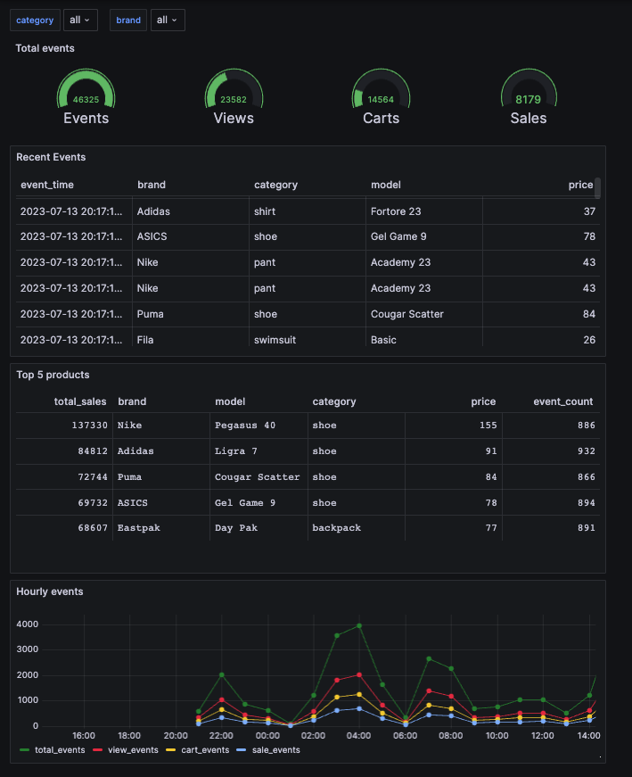

## Dashboard details

* This definition JSON file can be imported to Grafana to provide a dashboard foundation. 
* After importing the definition file, you will need to navigate to all the visualizations and update the `token` query parameters. 
* You will also need to create your own Data Source and configure it with your Workspace URL. 
* See the /data-project/endpoints for two APIs that supply Grafana data for building UI features: `api_brand.json` and `api_category.json`. Grafana will make requests to get the strings/names for your dashboard UI. These endpoints return unique category and brand values from the `products` dimensional table. The good thing here is that as your dimensional data changes (i.e. adding new products), the Grafana UI will pick up the changes. 

To get started, see this [guide on consuming API Endpoints in Grafana](https://www.tinybird.co/docs/guides/consume-api-endpoints-in-grafana.html).  

